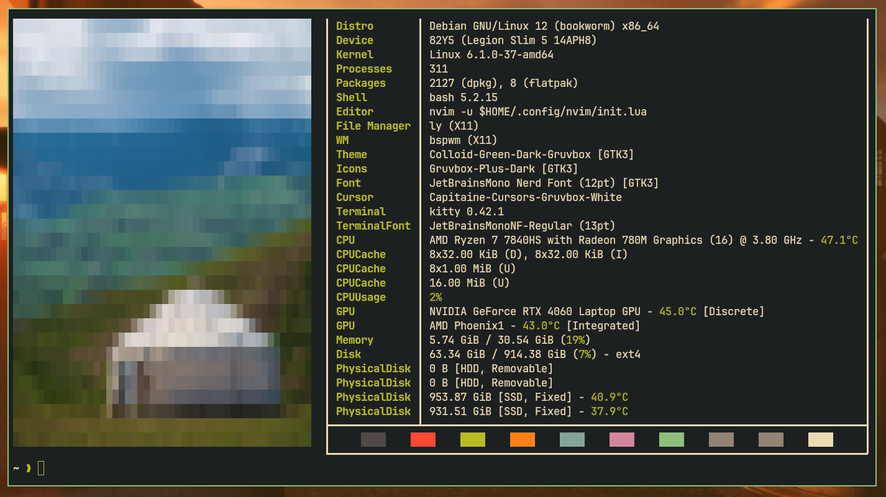

<h1 align="center">:penguin: dotfiles</h1>

> [!IMPORTANT]
>
> - **There are no install (reproduce) scripts in this repository. But feel free to take some parts/ideas of my config for your own one.**
> - **Most of the Bash scripts are in [`bash/`](bash/), [`bspwm/`](bspwm/), [`lf/`](lf/), [`rofi/`](rofi/), [`succade/`](succade/), [`sxhkd/`](sxhkd/).**
> - **Neovim dotfiles are stored in another repository ([**atom-vim**](https://github.com/adiyat-abubakirov/atom-vim)).**

> [!NOTE]
>
> - **For more screenshots, see [Screenshots](https://github.com/adiyat-abubakirov/dotfiles/wiki/Screenshots).**
> - **Wallpapers are from the "wallhaven" website.**

## :green_book: About

- OS: [**`Debian Bookworm`**](https://www.debian.org/releases/bookworm/)
- Shell: [**`Bash`**](https://www.gnu.org/software/bash/)
- Custom Shell Prompt: [**`Oh My Posh`**](https://ohmyposh.dev/)
- Terminal: [**`Kitty`**](https://sw.kovidgoyal.net/kitty/)
- Main Code Editor: [**`Neovim`**](https://neovim.io/)\*
- GUI Protocol: [**`Xorg`**](https://wiki.archlinux.org/title/Xorg)
- Window Manager: [**`BSPWM`**](https://github.com/baskerville/bspwm)
- Status Bar: [**`Lemonbar`**](https://gitlab.com/protesilaos/lemonbar-xft)\*\* with [**`Succade`**](https://github.com/domsson/succade)
- Lockscreen Software: [**`i3lock-color`**](https://github.com/Raymo111/i3lock-color)
- Hotkey Daemon: [**`Sxhkd`**](https://github.com/baskerville/sxhkd)
- App Launcher: [**`Rofi`**](https://github.com/davatorium/rofi)
- File Manager: [**`LF`**](https://github.com/gokcehan/lf)
- Notification Daemon: [**`Dunst`**](https://github.com/dunst-project/dunst)
- System Monitoring: [**`Btop`**](https://github.com/aristocratos/btop)
- System Info Fetch Software: [**`Fastfetch`**](https://github.com/fastfetch-cli/fastfetch)
- Media Player: [**`MPV`**](https://mpv.io/)
- Screenshot Tool: [**`Flameshot`**](https://flameshot.org/)
- Main Font: [**`JetBrainsMono Nerd Font`**](https://github.com/ryanoasis/nerd-fonts)
- Color Scheme: [**`Gruvbox`**](https://github.com/morhetz/gruvbox)
- GTK Icon Theme: [**`Gruvbox Plus Dark`**](https://github.com/SylEleuth/gruvbox-plus-icon-pack)
- GTK Theme: [**`Colloid Green Dark Gruvbox`**](https://github.com/vinceliuice/Colloid-gtk-theme)

\* - I use Neovim with my own configuration, no forks. 

\*\* - In order to use Nerd Font with lemonbar, I use a fork of lemonbar from GitLab with XFT support. Succade is a lemonbar manager that helps configure lemonbar easier, without a Bash script.

## :rocket: Key Features

- Automatic Bluetooth pairing & reconnection using Bash scripting & Bluetoothctl, [`sxhkd/bluetooth.sh`](sxhkd/bluetooth.sh).
- Bash script, [`sxhkd/kitty.sh`](sxhkd/kitty.sh), creates new terminal window with working directory from the currently focused terminal window, if present.

* Bash script, [`bspwm/launch.sh`](bspwm/launch.sh), optimizes programs for specific monitor resolutions.
  - Every time the BSPWM launches (every boot), checks which display is now active using xrandr & then creates symbolic links to configuration files for the corresponding resolution. `.builtin` files are for 2880x1800 14" & `.external` files are for 1920x1080 24".

- Succade configured with Nerd Font & Bash scripts that use Succade's API to underline & change the foreground of text for personal needs. Examples: [`workspaces.sh`](succade/workspaces.sh), [`battery.sh`](succade/battery.sh), [`bluetooth.sh`](succade/bluetooth.sh).
- Bash script, [`rofi/powermenu.sh`](rofi/powermenu.sh) - custom rofi menu for power control.

---

<h3 align=center>If you found this repository helpful, please give it a :star:</h3>
